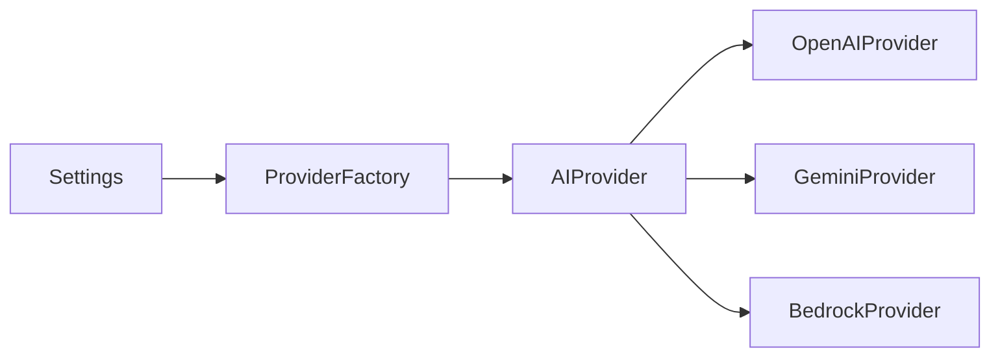

# ADR-0001: Centralize Provider Creation with a Factory

## Status

Accepted

## Date

2026-06-27

## Authors

Enterprise AI Platform Team

## Business Requirement

The platform must switch between supported LLM providers without coupling
application services to provider-specific implementations.

## Context

OpenAI, Gemini, and AWS Bedrock implement the common `AIProvider` interface.
Provider selection comes from centralized configuration and must resolve
consistently across entry points and future services.

## Decision Drivers

- Keep application services independent of provider SDKs.
- Centralize provider validation and construction.
- Make new providers straightforward to add.
- Preserve a common generation contract.
- Support provider selection through configuration.

## Decision

Use `ProviderFactory` as the single entry point for provider construction. It
maps `ProviderName` values to concrete `AIProvider` classes and returns the
implementation selected by configuration.

## Architecture Diagram

See [provider_factory.drawio](../diagrams/provider_factory.drawio).

## Design Patterns

- Factory Method: centralizes provider object creation.
- Strategy: each provider is an interchangeable generation strategy.
- Dependency Inversion: callers depend on `AIProvider`, not concrete classes.

## Alternatives Considered

- Direct construction at each call site would duplicate selection logic.
- Conditional selection in `main.py` would not scale across services.
- A dependency injection framework would add premature lifecycle complexity.

## Consequences

- Provider construction and validation are consistent.
- Services can operate against a stable provider interface.
- Adding a provider currently requires changing the factory mapping.
- Constructor dependencies must eventually be supplied by the factory.

## Risks

- The factory can become a large conditional registry as providers grow.
- Provider-specific features may pressure the shared interface.
- Misconfigured enabled providers are not yet rejected during creation.

## Future Improvements

- Extract registration into a provider registry.
- Inject provider clients and settings into constructors.
- Add health checks, capability metadata, and lifecycle management.
- Add fallback and routing policies without changing service callers.

## Related ADRs

- [ADR-0003: Centralized Configuration](ADR-0003-Configuration.md)
- ADR for provider registry: planned.
- ADR for fallback strategy: planned.

## Related Requirements

- [NFR-EXT-001: Provider extensibility](../architecture/nfr.md#nfr-ext-001-provider-extensibility)
- [NFR-MNT-001: Maintainability](../architecture/nfr.md#nfr-mnt-001-maintainability)

## Project Improvement

- Removes direct provider imports from the application entry point.
- Establishes one construction path for every implemented provider.
- Creates a foundation for registry-based discovery and fallback routing.
