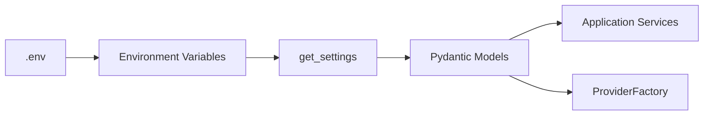

# ADR-0003: Centralize Application Configuration

## Status

Accepted

## Date

2026-06-27

## Authors

Enterprise AI Platform Team

## Business Requirement

All services must use one validated source of truth for API keys, models,
provider options, and operational settings.

## Context

Provider configuration is supplied through environment variables and `.env`
during local development. Scattered environment reads would create inconsistent
defaults, validation, and naming across the platform.

## Decision Drivers

- Central ownership of provider and application settings.
- Validation before settings reach services.
- Environment-based deployment configuration.
- Safe local development without committing secrets.
- Low-cost repeated access to immutable settings.

## Decision

Load environment variables through `python-dotenv`, validate them with Pydantic
models, and expose a cached `get_settings()` function. Provider-specific values
are grouped into typed settings models and selected through `Settings.provider()`.

## Architecture Diagram

## Design Patterns

- Singleton: `lru_cache` returns one settings instance per process.
- Configuration Object: typed models group related settings.
- Facade: `get_settings()` hides loading and validation details.

## Alternatives Considered

- Direct `os.getenv()` calls in each module would duplicate defaults.
- Static constants cannot safely represent deployment-specific secrets.
- A remote configuration service adds infrastructure not yet required.

## Consequences

- Invalid typed values fail during configuration construction.
- Services consume consistent models and defaults.
- Process-level caching means environment changes require cache clearing or restart.
- Secrets remain environment-managed rather than hard-coded.

## Risks

- Invalid integer or provider values currently surface as startup exceptions.
- Loading `.env` in production could mask deployment configuration mistakes.
- Cached mutable models could be changed accidentally at runtime.

## Future Improvements

- Use `pydantic-settings` with explicit environment aliases.
- Make settings immutable.
- Add startup validation for enabled providers and required credentials.
- Integrate a managed secrets service for production.

## Related ADRs

- [ADR-0001: Provider Factory](ADR-0001-ProviderFactory.md)
- [ADR-0002: Centralized Logging](ADR-0002-Logging.md)

## Related Requirements

- [NFR-CFG-001: Configuration consistency](../architecture/nfr.md#nfr-cfg-001-configuration-consistency)
- [NFR-SEC-001: Secret protection](../architecture/nfr.md#nfr-sec-001-secret-protection)

## Project Improvement

- Establishes validated configuration boundaries.
- Eliminates hard-coded provider models and operational defaults from services.
- Enables deployment-specific behavior without code changes.
