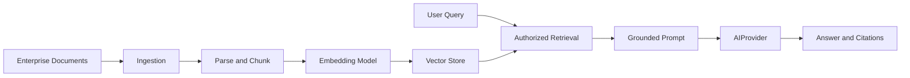

# ADR-0004: Retrieval-Augmented Generation Architecture

## Status

Proposed

## Date

2026-06-27

## Authors

Enterprise AI Platform Team

## Business Requirement

The platform should answer enterprise questions using approved organizational
knowledge while preserving source traceability and access controls.

## Context

Base LLMs do not contain current private enterprise knowledge. Retrieval-
augmented generation can ground responses in indexed documents, but the
platform has not yet selected its vector store, embedding model, chunking
strategy, tenancy model, or evaluation criteria.

## Decision Drivers

- Grounded answers with citations.
- Enterprise data isolation and authorization.
- Provider-independent retrieval.
- Measurable retrieval and answer quality.
- Predictable latency and cost.

## Decision

Propose a provider-neutral RAG pipeline with ingestion, parsing, chunking,
embedding, vector storage, authorized retrieval, prompt augmentation, and cited
generation. Final technology selections require a proof of concept and quality
evaluation before this ADR can be accepted.

## Architecture Diagram

Editable source: [rag_architecture.drawio](../diagrams/rag_architecture.drawio).

## Design Patterns

- Pipeline: separates ingestion and query processing stages.
- Ports and Adapters: isolates vector stores and embedding providers.
- Strategy: allows retrieval and reranking approaches to vary.

## Alternatives Considered

- Fine-tuning does not provide reliable source attribution or rapid updates.
- Sending complete documents exceeds context limits and increases cost.
- Provider-managed retrieval reduces control and portability.

## Consequences

- Enterprise content can ground responses without model retraining.
- New infrastructure is required for ingestion, indexing, and retrieval.
- Answer quality depends on document quality, chunking, and ranking.

## Risks

- Retrieval may expose content across authorization boundaries.
- Prompt injection can enter through indexed documents.
- Stale indexes may produce outdated answers.
- Weak retrieval may create confidently incorrect grounded responses.

## Future Improvements

- Evaluate hybrid search, metadata filtering, and reranking.
- Add document-level authorization and deletion propagation.
- Build offline evaluation datasets and quality gates.
- Add ingestion lineage, freshness monitoring, and citation verification.

## Related ADRs

- [ADR-0001: Provider Factory](ADR-0001-ProviderFactory.md)
- ADR for vector-store selection: planned.
- ADR for embedding-model selection: planned.

## Related Requirements

- [NFR-SEC-002: Tenant isolation](../architecture/nfr.md#nfr-sec-002-tenant-isolation)
- [NFR-QLT-001: Answer quality](../architecture/nfr.md#nfr-qlt-001-answer-quality)

## Project Improvement

- Defines the evaluation work needed before RAG implementation.
- Establishes security and citation requirements as architecture constraints.
