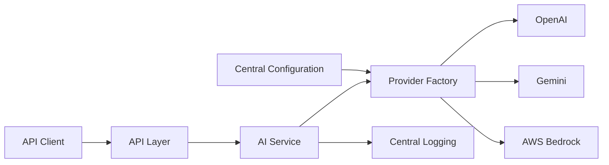

# Architecture Overview

The Enterprise AI Platform provides one application-facing interface across
multiple LLM providers. Configuration selects a provider, the provider factory
constructs its implementation, and services call the shared `AIProvider`
contract.

## Layers

- API: validates transport requests and responses.
- Services: coordinates business workflows independent of provider SDKs.
- Providers: adapts external LLM APIs to `AIProvider`.
- Core: owns configuration, constants, logging, and shared exceptions.
- Models: defines internal and API data contracts.

## Architecture Principles

- Depend on provider abstractions rather than SDK implementations.
- Keep secrets and deployment choices outside source code.
- Record consequential design decisions as ADRs.
- Make security, observability, and testability explicit requirements.
- Introduce infrastructure only after measurable requirements are defined.
